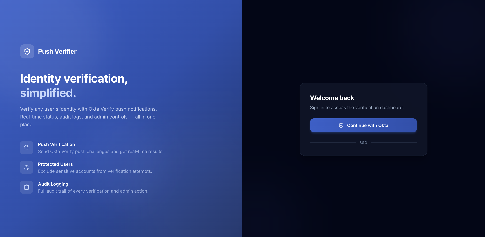
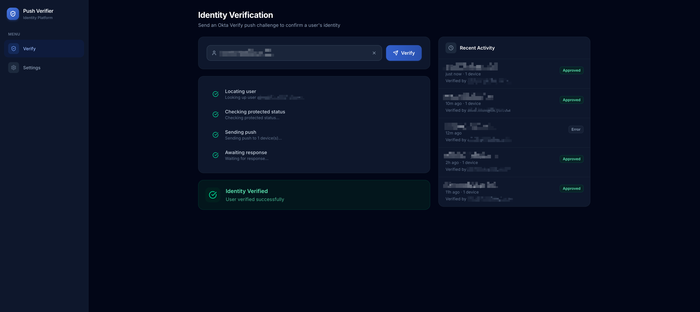

# Push Verifier

[](LICENSE)
[](https://python.org)
[](https://nodejs.org)
[](https://typescriptlang.org)

> **Disclaimer:** This is an independent, community-built project. It is not developed, endorsed, or supported by Okta, Inc. "Okta" and "Okta Verify" are trademarks of Okta, Inc.

An open-source identity verification tool that sends Okta Verify Push challenges to a user's enrolled devices and streams the result back to the browser in real time.

An operator types in a username, the backend fans out push notifications to every active device, polls for a response (up to 30 seconds), and the frontend shows live progress via Server-Sent Events.





## Features

- **Real-time push verification** with live SSE progress (locating, pushing, polling, result)
- **Protected users** that are excluded from verification (case-insensitive, admin-managed)
- **Role-based access control** via Okta groups (admin / operator)
- **Audit logging** for verification attempts and all admin actions
- **Rate limiting** at 5 requests/minute per IP
- **Dark mode** with system detection and manual toggle
- **Single-command setup** via Docker Compose or the dev script

## How It Works

```
Browser                    Backend                     Okta
  │                          │                           │
  │── POST /api/verify ─────>│                           │
  │                          │── GET  /api/v1/users ────>│  look up user
  │<── SSE: locating ────────│<──────────────────────────│
  │                          │                           │
  │                          │── POST factors/.../verify >│  send push
  │<── SSE: pushing ─────────│<──────────────────────────│
  │                          │                           │
  │                          │── GET  poll_url ──────────>│  poll (1s intervals)
  │<── SSE: polling ─────────│<──────────────────────────│
  │                          │                           │
  │<── SSE: result ──────────│  (approved / rejected / timeout)
  │                          │                           │
```

The browser authenticates via Okta OIDC (PKCE). The backend validates the JWT with JWKS, resolves the user's role from Okta group claims, and authorises the request.

## Quick Start

### Prerequisites

- An Okta developer account ([free sign-up](https://developer.okta.com/signup/))

### 1. Clone and configure

```bash
git clone https://github.com/alfredkzr/okta-user-push-verifier.git
cd okta-user-push-verifier
cp backend/.env.example backend/.env
```

Edit `backend/.env` with your Okta credentials (see [Okta Setup](#okta-setup) below).

### 2. Run

```bash
docker compose up
```

The app is available at **http://localhost:8000**. The app stores data in a SQLite database that persists via the `app-data` Docker volume; the database is created on first startup.

### Local development (hot reload)

If you want live reloading for frontend and backend changes:

```bash
./start.sh
```

This starts the FastAPI backend (port 8001 with `--reload`) and the Vite dev server (port 5173, proxying `/api` to the backend).

## Okta Setup

You need **two** Okta applications:

### 1. SPA Application (frontend login)

- Type: OIDC - Single-Page Application
- Grant type: Authorization Code with PKCE
- Sign-in redirect URI: `http://localhost:5173/login/callback` (dev) or `http://localhost:8000/login/callback` (Docker)
- Scopes: `openid`, `profile`, `email`, `groups`

### 2. Service Application (backend API calls)

- Type: API Services
- Client authentication: `private_key_jwt`
- Scope: `okta.users.manage`
- Generate a key pair and download the private key
- Assign an **admin role** to the app with least privilege (Applications > your service app > Admin roles):
  1. Go to **Security > Administrators > Roles > Create new role**
  2. Add these permissions:
     - **View users and their details**
     - **Edit users' authenticator operations**
     - **Manage users**
  3. Save the role, then assign it to your service app under **Applications > your service app > Admin roles**
  4. Scope the role to a resource set containing the users you want to verify (or all users)

### Groups

Create two groups in Okta and assign users:

| Group | Role | Access |
|-------|------|--------|
| `push-verifier-admin` | Admin | Verify users, manage protected users, view audit log |
| `push-verifier-user` | Operator | Verify users, view recent activity |

Add a **groups** claim to your authorization server (Security > API > Authorization Servers > Claims) so group membership appears in tokens.

## Configuration

| Variable | Description | Default |
|----------|-------------|---------|
| `OKTA_DOMAIN` | Your Okta org URL (e.g. `https://dev-123.okta.com`) | *required* |
| `OKTA_CLIENT_ID` | Service application client ID | *required* |
| `OKTA_PRIVATE_KEY_B64` | Base64-encoded PEM private key for the service app | *required* |
| `OKTA_KEY_ID` | JWK key ID (`kid`) for the private key | `""` |
| `OKTA_SCOPES` | OAuth scopes for Okta API calls | `okta.users.manage` |
| `OIDC_ISSUER` | OIDC issuer URL (e.g. `https://dev-123.okta.com/oauth2/default`) | *required* |
| `OIDC_CLIENT_ID` | SPA application client ID | *required* |
| `ADMIN_GROUP` | Okta group name for admins | `push-verifier-admin` |
| `USER_GROUP` | Okta group name for operators | `push-verifier-user` |
| `DATABASE_PATH` | Path to SQLite database file | `data/push-verifier.db` |

## Tech Stack

| Layer | Technology |
|-------|-----------|
| Frontend | React 19, TypeScript 5.7, Vite 6, Tailwind CSS v4 |
| Backend | Python 3.13, FastAPI, Uvicorn, httpx, PyJWT, slowapi |
| Database | SQLite |
| Auth | Okta OIDC (PKCE) + Okta API (`private_key_jwt`) |

## Project Structure

```
backend/
  main.py              App factory, lifespan, middleware, SPA catch-all
  config.py            Settings from environment / .env
  auth.py              JWT validation, RBAC dependencies
  db.py                SQLite database operations
  models.py            Pydantic request/response schemas
  rate_limit.py        Rate limiter configuration
  routers/
    auth_routes.py     GET /api/auth/config, GET /api/me
    verify.py          POST /api/verify (SSE), GET /api/verification-log
    settings.py        Protected users CRUD, audit log (admin)
    health.py          GET /api/health
  services/
    okta.py            User lookup, push challenge, transaction polling

frontend/
  src/
    main.tsx           Fetches auth config, initialises OktaAuth
    App.tsx            Routes and auth guards
    auth.tsx           Auth context (tokens, role, headers)
    components/
      Layout.tsx       Responsive sidebar, nav, user info
      LoginPage.tsx    Okta OIDC sign-in
      VerifierPage.tsx Push verification UI + activity log
      SettingsPage.tsx Protected users + audit log (admin)
      ThemeContext.tsx  Dark/light theme provider

Dockerfile             Multi-stage build (Node -> Python)
docker-compose.yml     Production deployment
start.sh               Local dev with hot reload
```

## Contributing

See [CONTRIBUTING.md](CONTRIBUTING.md).

## License

[MIT](LICENSE)
